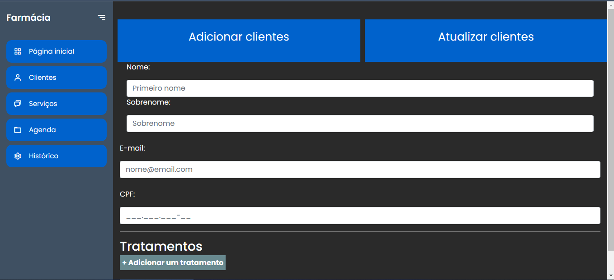

<h1 align="center">Pharmacy</h1>

<h1 align="center">

</h1>

<h2 align="center">
System information
</h2>

- Interface with sidebar
- Registration form

<h3>Options</h3>

- Home page
- Customers
- Services
- Schedule
- Historic
- Add customers
- Update clients
- Add a treatment

<h2 align="center">
Interface image
</h2>

<h1 align="center">

</h1>

<h3>Access my post on linkedin.</h3>

 
 

<h4 align="center"> 
	 Project under development 🛠️
</h4>

 
 

Features:

- [x]  Create virtual environment.
- [x]  CSS.
- [x]  Bootstrap
- [x]  HTML.
- [x]  Java Script
- [ ]  Configure registration.

<h2 align="center">
 🛠 Technologies
</h2>

Tools used to create the system:

- [Python](https://www.python.org/)
- [Django](https://www.djangoproject.com/)
- [HTML5](https://html.spec.whatwg.org/)
- [CSS3](https://www.w3.org/TR/css3-roadmap/)
- [Bootstrap](https://getbootstrap.com/)
- [Javascript](https://www.javascript.com/)
- [VS CODE](https://code.visualstudio.com/)